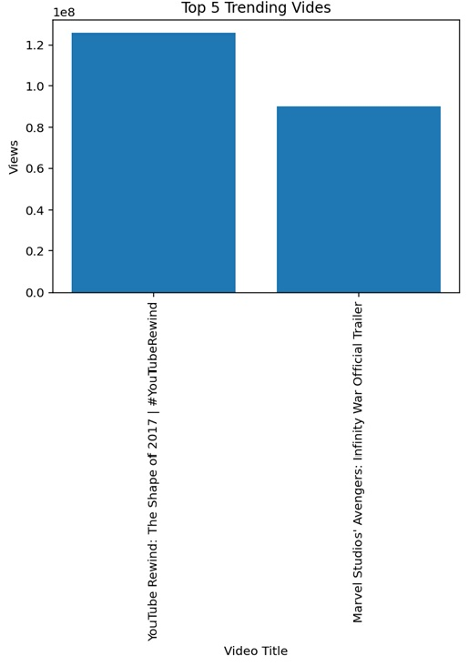
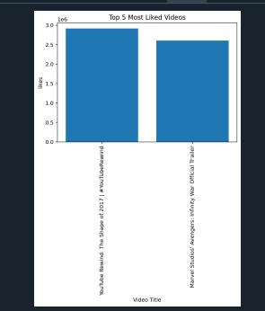
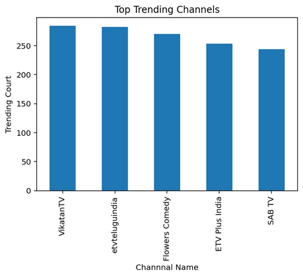
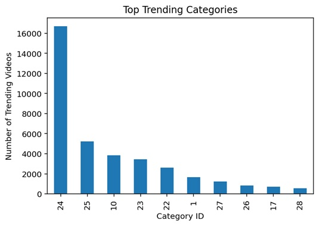
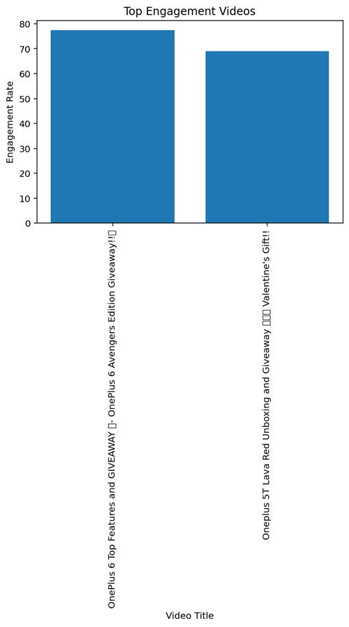
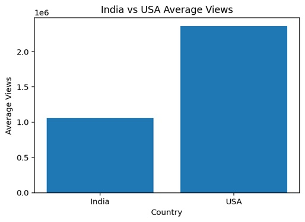

# YouTube Analytics

## Project Overview

YouTube Analytics is a Python-based data analysis project that analyzes
YouTube trending videos using the India and USA trending video datasets.

The project uses Pandas for data analysis and Matplotlib for creating
visualizations.

## Technologies Used

- Python
- Pandas
- Matplotlib
- CSV Dataset

## Dataset

The project uses YouTube trending video datasets such as:

- INvideos.csv - India
- USvideos.csv - USA

## Analysis Performed

### 1. Top 5 Most Viewed Videos

The project sorts videos based on the number of views and identifies
the top 5 most viewed videos.

### 2. Top 5 Most Liked Videos

The project analyzes the likes column and identifies the top 5
most liked videos.

### 3. Top Trending Channels

The project counts how frequently each channel appears in the
trending video dataset and identifies the most frequently trending
channels.

### 4. Views vs Likes Analysis

A scatter plot is created to analyze the relationship between
video views and likes.

### 5. Trending Category Analysis

The project analyzes category IDs and identifies the categories
with the highest number of trending videos.

### 6. Engagement Rate Analysis

The project calculates the engagement rate using likes,
comments, and views.

Formula:

Engagement Rate = (Likes + Comments) / Views × 100

The videos are then sorted based on their engagement rate.

### 7. India vs USA Comparison

The project calculates and compares the average number of views
for videos from India and the USA.

## Visualizations

The project generates the following charts:

- Top 5 Trending Videos by Views
- Top 5 Most Liked Videos
- Top Trending Channels
- Views vs Likes
- Top Trending Categories
- Top Engagement Videos
- India vs USA Average Views

## How to Run the Project

### Step 1: Install Python

Install Python on your computer.

### Step 2: Install Required Libraries

```bash
pip install pandas matplotlib
## Project Results

### Top Trending Videos


### Most Liked Videos


### Trending Channels


### Trending Categories


### Views vs Likes


### Engagement Analysis


### India vs USA

